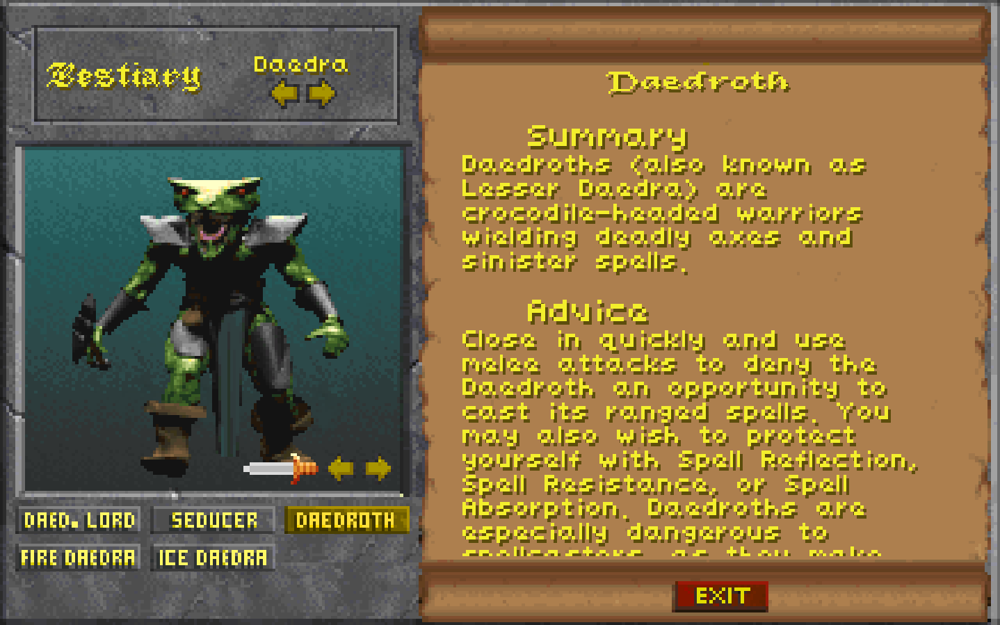
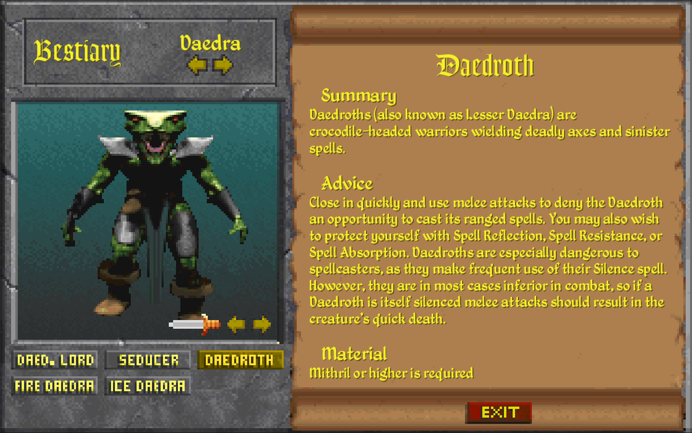

# Bestiary

* A mod for [Daggerfall Unity](https://www.dfworkshop.net/)
* Bestiary is a mod, that reintroduces the Bestiary as seen in one of [Daggerfall's demos](https://archive.org/details/TheElderScrollsDaggerfall_1020), and further builds upon it

## Video Demonstration

[](http://www.youtube.com/watch?v=bcpwmayP4M8 "Bestiary Demonstration")

[Bestiary Demonstration](https://youtu.be/bcpwmayP4M8)

## Screenshot





## Description

* Bestiary is a mod, that reintroduces the Bestiary as seen in one of Daggerfall's demos, and further builds upon it
* Pressing "B", or the hotkey of choice, in-game will open the screen

## Credits
* [King of Worms](https://forums.dfworkshop.net/memberlist.php?mode=viewprofile&u=684) - D.R.E.A.M. Compactibility and UI partial UI design
* [Jagget](https://github.com/Jagget) - Author of patch 1.5 and 2.0
* [Ninelan](https://forums.dfworkshop.net/memberlist.php?mode=viewprofile&u=3251) - Bestiary item art
* [UESP](https://docs.google.com/document/d/122w336Ty--AFYz5MhlRW5mJlu6L4x0NcCVyCbbY6l8Q/edit?usp=sharing) - Most texts are copied (with minor editing) from here from here, or the [Daggerfall User's Guide](https://en.uesp.net/wiki/Books:Daggerfall_User%27s_Guide).

## Liks

* [Nexus](https://www.nexusmods.com/daggerfallunity/mods/222)
* [Forum post](https://forums.dfworkshop.net/viewtopic.php?t=5036)

## Changelog
```
1.0
Initial release

1.1
Rebuilt for DFU 12.2
Added dependencies check for Bestiary - DREAM patch, to ensure it always overrides bestiary data and isn't loaded without it
Fixed some entries showing incorrect spells
Added support for Kab's Unleveled Spells
Mod settings can now be edited mid-game (all except ClassicMode)

1.2
Killcounts are now tracked
Minor entry text change

1.3
Added "Bestiary" item, that spawns in the world
Added options setting to only unlock the Bestiary after finding the "Bestiary" item
Added options setting to only display entries of beasts already slain

1.4
Added more customization options
Added language skill required for pacification
Improved text formatting
Reworked a part of the internal, hopefully increasing stability
Fixed a bunch of bugs

1.5
All credit goes to Jagget
Uplifted interface
Added ACTIVE state to buttons
Smashed some bugs

2.0
All credit goes to Jagget
Reworked text database
Reworked page rendering
Fix humanoid bug
Vampires could also carry the book
The chance of the item spawning is lower now
Makes the mod updatable from other mods. (No need to built-in support for Unleveled Spells)
Fixed the darkened monster textures
Added text color settings (for alternative skins)
```
