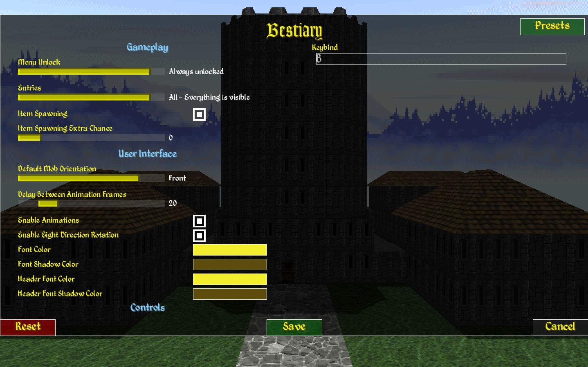

# Bestiary

* A mod for [Daggerfall Unity](https://www.dfworkshop.net/)
* Bestiary is a mod, that reintroduces the Bestiary as seen in one of [Daggerfall's demos](https://archive.org/details/TheElderScrollsDaggerfall_1020), and further builds upon it

## Video Demonstration

[](http://www.youtube.com/watch?v=bcpwmayP4M8 "Bestiary Demonstration")

[Bestiary Demonstration](https://youtu.be/bcpwmayP4M8)

## Screenshot




## Description

* Bestiary is a mod, that reintroduces the Bestiary as seen in one of Daggerfall's demos, and further builds upon it
* Pressing "B", or the hotkey of choice, in-game will open the screen

## Credits
* [King of Worms](https://forums.dfworkshop.net/memberlist.php?mode=viewprofile&u=684) - D.R.E.A.M. Compactibility and UI partial design
* [Jagget](https://github.com/Jagget) - Author of patch 1.5 and 2.0
* [Ninelan](https://forums.dfworkshop.net/memberlist.php?mode=viewprofile&u=3251) - Bestiary item art
* [UESP](https://docs.google.com/document/d/122w336Ty--AFYz5MhlRW5mJlu6L4x0NcCVyCbbY6l8Q/edit?usp=sharing) - Most texts are copied (with minor editing) from here from here, or the [Daggerfall User's Guide](https://en.uesp.net/wiki/Books:Daggerfall_User%27s_Guide).

## Liks

* [Nexus](https://www.nexusmods.com/daggerfallunity/mods/222)
* [Forum post](https://forums.dfworkshop.net/viewtopic.php?t=5036)

# Info for modders
You can use `SendModMessage` API to make changes in the Bestiary book.

## API and code examples

> In examples `"Rat"` is a record ID and equals `MonsterCareers.[monster].ToString()`

### OVERRIDE_TITLE
Allow to set monster page Title
```cs
ModManager.Instance.SendModMessage("Bestiary", "OVERRIDE_TITLE", new object[] { "Rat", "New Title" });
```

### OVERRIDE_SUMMARY
Allow to set monster Summary
```cs
ModManager.Instance.SendModMessage("Bestiary", "OVERRIDE_SUMMARY", new object[] { "Rat", "New summary text" });
```

### OVERRIDE_ADVICE
Allow to set monster Advice text
```cs
ModManager.Instance.SendModMessage("Bestiary", "OVERRIDE_ADVICE", new object[] { "Rat", "Always hit first!" });
```

### OVERRIDE_MATERIAL
Allow to set monster Material requirements text
```cs
ModManager.Instance.SendModMessage("Bestiary", "OVERRIDE_MATERIAL", new object[] { "Rat", "Use only gold weapon" });
```

### OVERRIDE_LANGUAGE
Allow to set monster Language
```cs
ModManager.Instance.SendModMessage("Bestiary", "OVERRIDE_LANGUAGE", new object[] { "Rat", "Sentinel dialect of Orcish" });
```

### OVERRIDE_ABILITIES
Allow to set monster Abilities list
```cs
ModManager.Instance.SendModMessage("Bestiary", "OVERRIDE_ABILITIES", new object[] { "Rat", new string[] { "Can swim", "Can jump", "Can run" } });
```

### OVERRIDE_SPELLS_BY_NAME
Allow to set monster Spells using names
If spells are overriden by names, then the IDs are ignored
```cs
ModManager.Instance.SendModMessage("Bestiary", "OVERRIDE_SPELLS_BY_NAME", new object[] { "Rat", new string[] { "Zipper", "Balina's poison", "Frost fist" } });
```

### OVERRIDE_SPELLS_BY_IDS
Allow to set monster Spells using standart IDs (won't do any effect if already overriden by names)
```cs
ModManager.Instance.SendModMessage("Bestiary", "OVERRIDE_SPELLS_BY_IDS", new object[] { "Rat", new int[] { 11, 23, 13, 8 } });
```

### REGISTER_CUSTOM_ENTITY

Register new monster records. The data will be attempted to read from MonsterName.csv

Your mod have to provide these files like: Wolf.csv, Walrus.csv, Raccoon.csv

See ExampleMonster.csv for details

```cs
ModManager.Instance.SendModMessage("Bestiary", "REGISTER_CUSTOM_ENTITY", new object[] { "Wolf", "Walrus", "Raccoon" });
```

**ExampleMonster.csv:**

> !For `button_wolf` you have to have `button_wolf.png` and `button_wolf_active.png` available!

```csv
Key,Value
Title,"Wolf"
ButtonTextureName,"button_wolf"
Summary,"Wolf Summary"
Advice,"Wolf Advice"
Material,"Wolf Material"
Language,"Wolf Language"
Abilities,"Bite
Sleep
Run"
NamedSpells,"Howl
Look cool"
TextureArchive,1612
```

### ADD_ENTITY_TO_EXISTING_PAGE
Add one more record to existing page, up to 9 per page
```cs
ModManager.Instance.SendModMessage("Bestiary", "ADD_ENTITY_TO_EXISTING_PAGE", new object[] { "page_animals", "Wolf" });
```

Page IDs for existing pages: page_animals, page_atronachs, page_daedra, page_lycanthropes, page_monsters1, page_monsters2, page_orcs, page_undead, page_classic

### REGISTER_CUSTOM_PAGE
Create and register new page with up to 9 records
```cs
ModManager.Instance.SendModMessage("Bestiary", "REGISTER_CUSTOM_PAGE", new object[] { "Page Title", "Page summary", new string[] { "Cockroach", "Walrus", "Raccoon" } });
```

# Changelog
```
1.0
Initial release

1.1
Rebuilt for DFU 12.2
Added dependencies check for Bestiary - DREAM patch, to ensure it always overrides bestiary data and isn't loaded without it
Fixed some entries showing incorrect spells
Added support for Kab's Unleveled Spells
Mod settings can now be edited mid-game (all except ClassicMode)

1.2
Killcounts are now tracked
Minor entry text change

1.3
Added "Bestiary" item, that spawns in the world
Added options setting to only unlock the Bestiary after finding the "Bestiary" item
Added options setting to only display entries of beasts already slain

1.4
Added more customization options
Added language skill required for pacification
Improved text formatting
Reworked a part of the internal, hopefully increasing stability
Fixed a bunch of bugs

1.5
All credit goes to Jagget
Uplifted interface
Added ACTIVE state to buttons
Smashed some bugs

2.0
All credit goes to Jagget
Reworked text database
Reworked page rendering
Fix humanoid bug
Vampires could also carry the book
The chance of the item spawning is lower now
Makes the mod updatable from other mods. (No need to built-in support for Unleveled Spells)
Fixed the darkened monster textures
Added text color settings (for alternative skins)

2.1
All credit goes to Jagget
Added ability for mods to modify existing pages, and to register extra pages 
```
